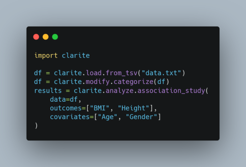
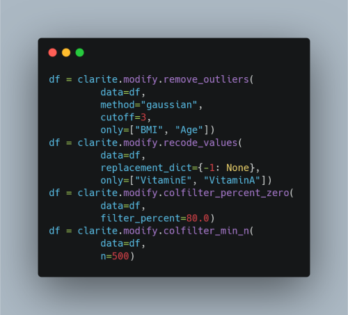
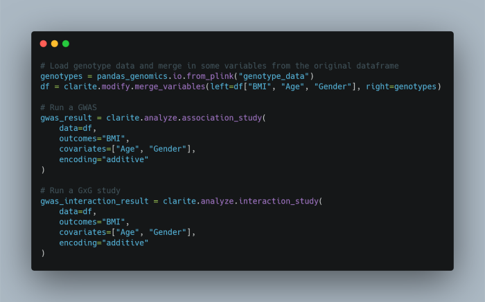

.. image:: https://raw.githubusercontent.com/HallLab/clarite-python/master/docs/source/_static/clarite_logo.png
   :target: https://clarite-python.readthedocs.io/en/stable/
   :align: center
   :alt: CLARITE Logo

------------

.. image:: https://img.shields.io/badge/python-3.7+-blue.svg?style=flat-square
   :target: https://pypi.python.org/pypi/clarite
   :alt: Python version

.. image:: https://img.shields.io/pypi/v/clarite.svg?style=flat-square
   :target: https://pypi.org/project/clarite/
   :alt: PyPI

.. image:: https://img.shields.io/github/workflow/status/HallLab/clarite-python/CI?style=flat-square
   :target: https://github.com/HallLab/clarite-python/actions?query=workflow%3ACI
   :alt: Build status

.. image:: https://img.shields.io/readthedocs/clarite-python?style=flat-square
   :target: https://clarite-python.readthedocs.io/en/latest/
   :alt: Docs

.. image:: https://img.shields.io/codecov/c/gh/HallLab/clarite-python.svg?style=flat-square
   :target: https://codecov.io/gh/HallLab/clarite-python/
   :alt: Test coverage

.. image:: https://img.shields.io/pypi/l/clarite?style=flat-square
   :target: https://opensource.org/licenses/BSD-3-Clause
   :alt: License

.. image:: https://img.shields.io/badge/code%20style-Black-black?style=flat-square
   :target: https://github.com/psf/black
   :alt: Black

------------

CLeaning to Analysis: Reproducibility-based Interface for Traits and Exposures
==============================================================================

* Free software: 3-clause BSD license
* Documentation: https://www.hall-lab.org/clarite-python/.

Examples
--------

**Run an EWAS in a few lines of code**

|

**More realistically, perform some QC first:**

|

**Genotype data is supported via Pandas-Genomics**

Installation
------------

In order to use the *r_survey* regression_kind in the *ewas* function, R must be installed along with the *survey* library.

1. Install R and ensure it is accessible from the command line.  You may need to add its location to the PATH environmental variable.
2. Use *install.packages* in R to install the *survey* library.

Questions
---------
If you have any questions not answered by the `documentation <https://clarite-python.readthedocs.io/en/latest/>`_,
feel free to open an `Issue <https://github.com/HallLab/clarite-python/issues>`_.

Citing CLARITE
--------------

1.
Lucas AM, et al (2019)
`CLARITE facilitates the quality control and analysis process for EWAS of metabolic-related traits. <https://www.frontiersin.org/article/10.3389/fgene.2019.01240>`_
*Frontiers in Genetics*: 10, 1240

2.
Passero K, et al (2020)
`Phenome-wide association studies on cardiovascular health and fatty acids considering phenotype quality control practices for epidemiological data. <https://www.worldscientific.com/doi/abs/10.1142/9789811215636_0058>`_
*Pacific Symposium on Biocomputing*: 25, 659
