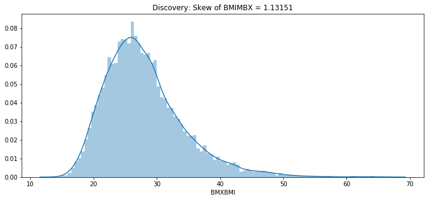
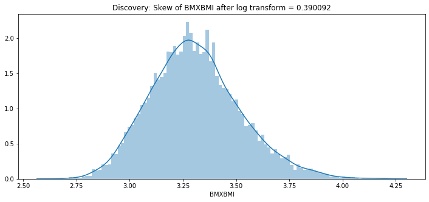
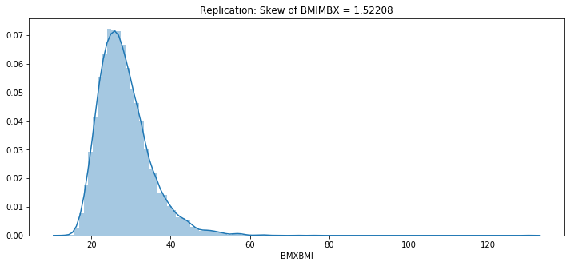
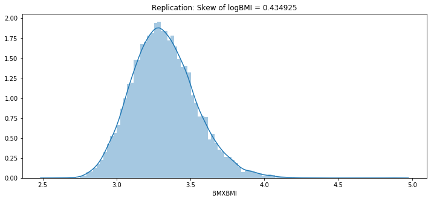
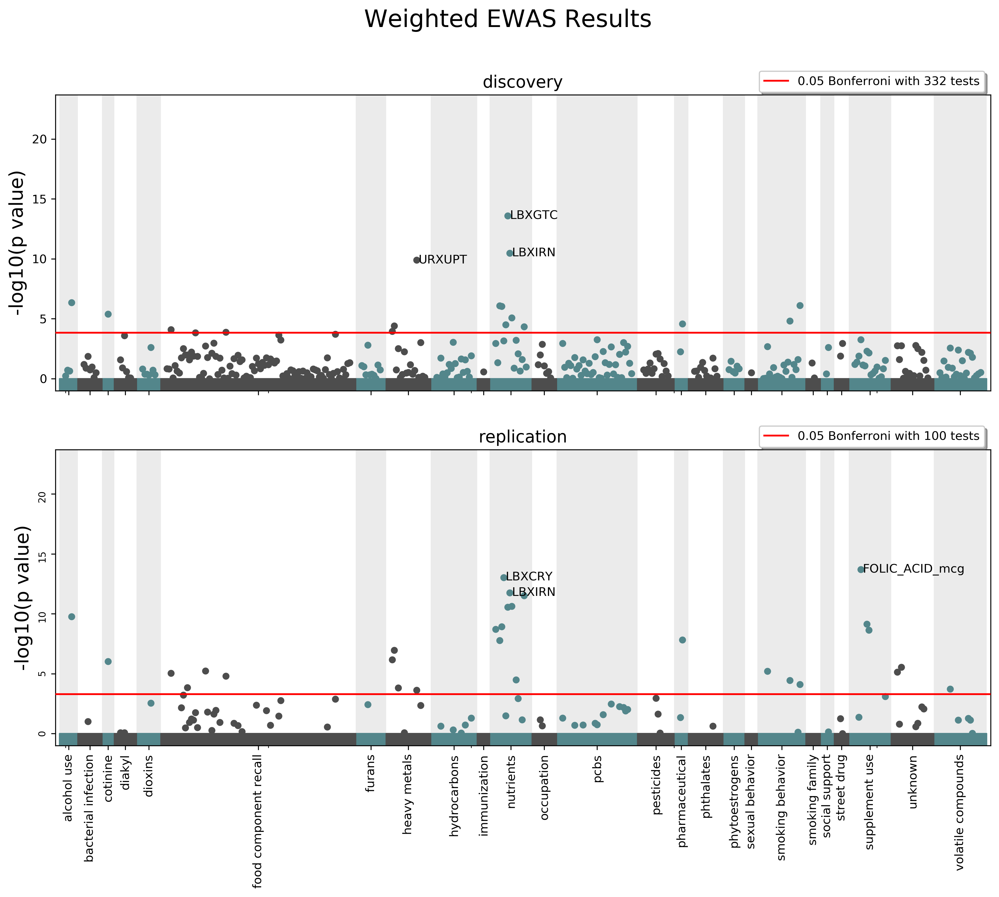

Example Analysis
================

*CLARITE facilitates the quality control and analysis process for EWAS
of metabolic-related traits*

[Paper in review]

Data from NHANES was used in an EWAS analysis including utilizing the
provided survey weight information. The first two cycles of NHANES
(1999-2000 and 2001-2002) are assigned to a ‘discovery’ dataset and the
next two cycles (2003-2004 and 2005-2006) are assigned to a
‘replication’ datset.

.. code:: ipython3

    import pandas as pd
    import numpy as np
    from scipy import stats
    import clarite

.. code:: ipython3

    pd.options.display.max_rows = 10
    pd.options.display.max_columns = 6

Load Data
---------

.. code:: ipython3

    data_folder = "../../../../data/NHANES_99-06/"
    data_main_table_over18 = data_folder + "MainTable_keepvar_over18.tsv"
    data_main_table = data_folder + "MainTable.csv"
    data_var_description = data_folder + "VarDescription.csv"
    data_var_categories = data_folder + "VarCat_nopf.txt"
    output = "."

Data of all samples with age >= 18
~~~~~~~~~~~~~~~~~~~~~~~~~~~~~~~~~~

.. code:: ipython3

    # Data
    nhanes = clarite.load.from_tsv(data_main_table_over18, index_col="ID")
    nhanes.head()

.. parsed-literal::

    Loaded 22,624 observations of 970 variables

.. raw:: html

    

    
    <table border="1" class="dataframe">
      <thead>
        <tr style="text-align: right;">
          <th></th>
          <th>RIDAGEYR</th>
          <th>female</th>
          <th>black</th>
          <th>...</th>
          <th>LBXV4E</th>
          <th>LBXVTE</th>
          <th>occupation</th>
        </tr>
        <tr>
          <th>ID</th>
          <th></th>
          <th></th>
          <th></th>
          <th></th>
          <th></th>
          <th></th>
          <th></th>
        </tr>
      </thead>
      <tbody>
        <tr>
          <th>2</th>
          <td>77</td>
          <td>0</td>
          <td>0</td>
          <td>...</td>
          <td>NaN</td>
          <td>NaN</td>
          <td>1.0</td>
        </tr>
        <tr>
          <th>5</th>
          <td>49</td>
          <td>0</td>
          <td>0</td>
          <td>...</td>
          <td>NaN</td>
          <td>NaN</td>
          <td>NaN</td>
        </tr>
        <tr>
          <th>6</th>
          <td>19</td>
          <td>1</td>
          <td>0</td>
          <td>...</td>
          <td>NaN</td>
          <td>NaN</td>
          <td>2.0</td>
        </tr>
        <tr>
          <th>7</th>
          <td>59</td>
          <td>1</td>
          <td>1</td>
          <td>...</td>
          <td>NaN</td>
          <td>NaN</td>
          <td>NaN</td>
        </tr>
        <tr>
          <th>10</th>
          <td>43</td>
          <td>0</td>
          <td>1</td>
          <td>...</td>
          <td>NaN</td>
          <td>NaN</td>
          <td>4.0</td>
        </tr>
      </tbody>
    </table>
    
5 rows × 970 columns

    

Variable Descriptions
~~~~~~~~~~~~~~~~~~~~~

.. code:: ipython3

    var_descriptions = pd.read_csv(data_var_description)[["tab_desc","module","var","var_desc"]]\
                         .drop_duplicates()\
                         .set_index("var")
    var_descriptions.head()

.. raw:: html

    

    
    <table border="1" class="dataframe">
      <thead>
        <tr style="text-align: right;">
          <th></th>
          <th>tab_desc</th>
          <th>module</th>
          <th>var_desc</th>
        </tr>
        <tr>
          <th>var</th>
          <th></th>
          <th></th>
          <th></th>
        </tr>
      </thead>
      <tbody>
        <tr>
          <th>LBXHBC</th>
          <td>Hepatitis A, B, C and D</td>
          <td>laboratory</td>
          <td>Hepatitis B core antibody</td>
        </tr>
        <tr>
          <th>LBDHBG</th>
          <td>Hepatitis A, B, C and D</td>
          <td>laboratory</td>
          <td>Hepatitis B surface antigen</td>
        </tr>
        <tr>
          <th>LBDHCV</th>
          <td>Hepatitis A, B, C and D</td>
          <td>laboratory</td>
          <td>Hepatitis C antibody (confirmed)</td>
        </tr>
        <tr>
          <th>LBDHD</th>
          <td>Hepatitis A, B, C and D</td>
          <td>laboratory</td>
          <td>Hepatitis D (anti-HDV)</td>
        </tr>
        <tr>
          <th>LBXHBS</th>
          <td>Hepatitis B Surface Antibody</td>
          <td>laboratory</td>
          <td>Hepatitis B Surface Antibody</td>
        </tr>
      </tbody>
    </table>
    

.. code:: ipython3

    # Convert variable descriptions to a dictionary for convenience
    var_descr_dict = var_descriptions["var_desc"].to_dict()

Survey Weights, as provided by NHANES
~~~~~~~~~~~~~~~~~~~~~~~~~~~~~~~~~~~~~

Survey weight information is used so that the results apply to the US
civillian non-institutionalized population.

This includes:

-  SDMVPSU (Cluster ID)
-  SDMVSTRA (Nested Strata ID)
-  2-year weights
-  4-year weights

Different variables require different weights, as many of them were
measured on a subset of the full dataset. For example:

-  *WTINT* is the survey weight for interview variables.
-  *WTMEC* is the survey weight for variables measured in the Mobile
   Exam Centers (a subset of interviewed samples)

2-year and 4-year weights are provided. It is important to adjust the
weights when combining multiple cycles, by computing the weighted
average. In this case 4-year weights (covering the first 2 cycles) are
provided by NHANES and the replication weights (the 3rd and 4th cycles)
were computed from the 2-year weights prior to loading them here.

.. code:: ipython3

    survey_design_discovery = pd.read_csv(data_folder + "weights/weights_discovery.txt", sep="\t")\
                                .rename(columns={'SEQN':'ID'})\
                                .set_index("ID")\
                                .drop(columns="SDDSRVYR")
    survey_design_discovery.head()

.. raw:: html

    

    
    <table border="1" class="dataframe">
      <thead>
        <tr style="text-align: right;">
          <th></th>
          <th>SDMVPSU</th>
          <th>SDMVSTRA</th>
          <th>WTINT2YR</th>
          <th>...</th>
          <th>WTSVOC2Y</th>
          <th>WTSAU2YR</th>
          <th>WTUIO2YR</th>
        </tr>
        <tr>
          <th>ID</th>
          <th></th>
          <th></th>
          <th></th>
          <th></th>
          <th></th>
          <th></th>
          <th></th>
        </tr>
      </thead>
      <tbody>
        <tr>
          <th>1</th>
          <td>1</td>
          <td>5</td>
          <td>9727.078709</td>
          <td>...</td>
          <td>NaN</td>
          <td>NaN</td>
          <td>NaN</td>
        </tr>
        <tr>
          <th>2</th>
          <td>3</td>
          <td>1</td>
          <td>26678.636376</td>
          <td>...</td>
          <td>NaN</td>
          <td>NaN</td>
          <td>NaN</td>
        </tr>
        <tr>
          <th>3</th>
          <td>2</td>
          <td>7</td>
          <td>43621.680548</td>
          <td>...</td>
          <td>NaN</td>
          <td>NaN</td>
          <td>NaN</td>
        </tr>
        <tr>
          <th>4</th>
          <td>1</td>
          <td>2</td>
          <td>10346.119327</td>
          <td>...</td>
          <td>NaN</td>
          <td>NaN</td>
          <td>NaN</td>
        </tr>
        <tr>
          <th>5</th>
          <td>2</td>
          <td>8</td>
          <td>91050.846620</td>
          <td>...</td>
          <td>NaN</td>
          <td>NaN</td>
          <td>NaN</td>
        </tr>
      </tbody>
    </table>
    
5 rows × 35 columns

    

.. code:: ipython3

    survey_design_replication = pd.read_csv(data_folder + "weights/weights_replication_4yr.txt", sep="\t")\
                                .rename(columns={'SEQN':'ID'})\
                                .set_index("ID")\
                                .drop(columns="SDDSRVYR")
    survey_design_replication.head()

.. raw:: html

    

    
    <table border="1" class="dataframe">
      <thead>
        <tr style="text-align: right;">
          <th></th>
          <th>SDMVPSU</th>
          <th>SDMVSTRA</th>
          <th>WTINT2YR</th>
          <th>...</th>
          <th>WTSOG2YR</th>
          <th>WTSC2YRA</th>
          <th>WTSPC2YR</th>
        </tr>
        <tr>
          <th>ID</th>
          <th></th>
          <th></th>
          <th></th>
          <th></th>
          <th></th>
          <th></th>
          <th></th>
        </tr>
      </thead>
      <tbody>
        <tr>
          <th>21005</th>
          <td>2</td>
          <td>39</td>
          <td>2756.160474</td>
          <td>...</td>
          <td>NaN</td>
          <td>NaN</td>
          <td>NaN</td>
        </tr>
        <tr>
          <th>21006</th>
          <td>1</td>
          <td>41</td>
          <td>2711.070226</td>
          <td>...</td>
          <td>NaN</td>
          <td>NaN</td>
          <td>NaN</td>
        </tr>
        <tr>
          <th>21007</th>
          <td>2</td>
          <td>35</td>
          <td>19882.088706</td>
          <td>...</td>
          <td>NaN</td>
          <td>NaN</td>
          <td>NaN</td>
        </tr>
        <tr>
          <th>21008</th>
          <td>1</td>
          <td>32</td>
          <td>2799.749676</td>
          <td>...</td>
          <td>NaN</td>
          <td>NaN</td>
          <td>NaN</td>
        </tr>
        <tr>
          <th>21009</th>
          <td>2</td>
          <td>31</td>
          <td>48796.839489</td>
          <td>...</td>
          <td>NaN</td>
          <td>NaN</td>
          <td>NaN</td>
        </tr>
      </tbody>
    </table>
    
5 rows × 23 columns

    

.. code:: ipython3

    # These files map variables to their correct weights, and were compiled by reading throught the NHANES codebook
    var_weights = pd.read_csv(data_folder + "weights/VarWeights.csv")
    var_weights.head()

.. raw:: html

    

    
    <table border="1" class="dataframe">
      <thead>
        <tr style="text-align: right;">
          <th></th>
          <th>variable_name</th>
          <th>discovery</th>
          <th>replication</th>
        </tr>
      </thead>
      <tbody>
        <tr>
          <th>0</th>
          <td>99999</td>
          <td>WTMEC4YR</td>
          <td>WTMEC2YR</td>
        </tr>
        <tr>
          <th>1</th>
          <td>ACETAMINOPHEN__CODEINE</td>
          <td>WTMEC4YR</td>
          <td>WTMEC2YR</td>
        </tr>
        <tr>
          <th>2</th>
          <td>ACETAMINOPHEN__CODEINE_PHOSPHATE</td>
          <td>WTMEC4YR</td>
          <td>WTMEC2YR</td>
        </tr>
        <tr>
          <th>3</th>
          <td>ACETAMINOPHEN__HYDROCODONE</td>
          <td>WTMEC4YR</td>
          <td>WTMEC2YR</td>
        </tr>
        <tr>
          <th>4</th>
          <td>ACETAMINOPHEN__HYDROCODONE_BITARTRATE</td>
          <td>WTMEC4YR</td>
          <td>WTMEC2YR</td>
        </tr>
      </tbody>
    </table>
    

.. code:: ipython3

    # Convert the data to two dictionaries for convenience
    weights_discovery = var_weights.set_index('variable_name')['discovery'].to_dict()
    weights_replication = var_weights.set_index('variable_name')['replication'].to_dict()

Survey Year data
~~~~~~~~~~~~~~~~

Survey year is found in a separate file and can be matched using the
*SEQN* ID value.

.. code:: ipython3

    survey_year = pd.read_csv(data_main_table)[["SEQN", "SDDSRVYR"]].rename(columns={'SEQN':'ID'}).set_index("ID")
    nhanes = clarite.modify.merge_variables(nhanes, survey_year, how="left")

.. parsed-literal::

    ================================================================================
    Running merge_variables
    --------------------------------------------------------------------------------
    left Merge:
    	left = 22,624 observations of 970 variables
    	right = 41,474 observations of 1 variables
    Kept 22,624 observations of 971 variables.
    ================================================================================
    

Define the phenotype and covariates
-----------------------------------

.. code:: ipython3

    phenotype = "BMXBMI"
    print(f"{phenotype} = {var_descriptions.loc[phenotype, 'var_desc']}")
    covariates = ["female", "black", "mexican", "other_hispanic", "other_eth", "SES_LEVEL", "RIDAGEYR", "SDDSRVYR"]

.. parsed-literal::

    BMXBMI = Body Mass Index (kg/m**2)
    

Initial cleanup / variable selection
------------------------------------

Remove any samples missing the phenotype or one of the covariates
~~~~~~~~~~~~~~~~~~~~~~~~~~~~~~~~~~~~~~~~~~~~~~~~~~~~~~~~~~~~~~~~~

.. code:: ipython3

    nhanes = clarite.modify.rowfilter_incomplete_obs(nhanes, only=[phenotype] + covariates)

.. parsed-literal::

    ================================================================================
    Running rowfilter_incomplete_obs
    --------------------------------------------------------------------------------
    Removed 3,687 of 22,624 observations (16.30%) due to NA values in any of 9 variables
    ================================================================================
    

Remove variables that aren’t appropriate for the analysis
~~~~~~~~~~~~~~~~~~~~~~~~~~~~~~~~~~~~~~~~~~~~~~~~~~~~~~~~~

Physical fitness measures
^^^^^^^^^^^^^^^^^^^^^^^^^

These are measurements rather than proxies for environmental exposures

.. code:: ipython3

    phys_fitness_vars = ["CVDVOMAX","CVDESVO2","CVDS1HR","CVDS1SY","CVDS1DI","CVDS2HR","CVDS2SY","CVDS2DI","CVDR1HR","CVDR1SY","CVDR1DI","CVDR2HR","CVDR2SY","CVDR2DI","physical_activity"]
    for v in phys_fitness_vars:
        print(f"\t{v} = {var_descr_dict[v]}")
    nhanes = nhanes.drop(columns=phys_fitness_vars)

.. parsed-literal::

    	CVDVOMAX = Predicted VO2max (ml/kg/min)
    	CVDESVO2 = Estimated VO2max (ml/kg/min)
    	CVDS1HR = Stage 1 heart rate (per min)
    	CVDS1SY = Stage 1 systolic BP (mm Hg)
    	CVDS1DI = Stage 1 diastolic BP (mm Hg)
    	CVDS2HR = Stage 2 heart rate (per min)
    	CVDS2SY = Stage 2 systolic BP (mm Hg)
    	CVDS2DI = Stage 2 diastolic BP (mm Hg)
    	CVDR1HR = Recovery 1 heart rate (per min)
    	CVDR1SY = Recovery 1 systolic BP (mm Hg)
    	CVDR1DI = Recovery 1 diastolic BP (mm Hg)
    	CVDR2HR = Recovery 2 heart rate (per min)
    	CVDR2SY = Recovery 2 systolic BP (mm Hg)
    	CVDR2DI = Recovery 2 diastolic BP (mm Hg)
    	physical_activity = Physical Activity (MET-based rank)
    

Lipid variables
^^^^^^^^^^^^^^^

These are likely correlated with BMI in some way

.. code:: ipython3

    lipid_vars = ["LBDHDD", "LBDHDL", "LBDLDL", "LBXSTR", "LBXTC", "LBXTR"]
    print("Removing lipid measurement variables:")
    for v in lipid_vars:
        print(f"\t{v} = {var_descr_dict[v]}")
    nhanes = nhanes.drop(columns=lipid_vars)

.. parsed-literal::

    Removing lipid measurement variables:
    	LBDHDD = Direct HDL-Cholesterol (mg/dL)
    	LBDHDL = Direct HDL-Cholesterol (mg/dL)
    	LBDLDL = LDL-cholesterol (mg/dL)
    	LBXSTR = Triglycerides (mg/dL)
    	LBXTC = Total cholesterol (mg/dL)
    	LBXTR = Triglyceride (mg/dL)
    

Indeterminate variables
^^^^^^^^^^^^^^^^^^^^^^^

These variables don’t have clear meanings

.. code:: ipython3

    indeterminent_vars = ["house_type","hepa","hepb", "house_age", "current_past_smoking"]
    print("Removing variables with indeterminate meanings:")
    for v in indeterminent_vars:
        print(f"\t{v} = {var_descr_dict[v]}")
    nhanes = nhanes.drop(columns=indeterminent_vars)

.. parsed-literal::

    Removing variables with indeterminate meanings:
    	house_type = house type
    	hepa = hepatitis a
    	hepb = hepatitis b
    	house_age = house age
    	current_past_smoking = Current or Past Cigarette Smoker?
    

Recode “missing” values
~~~~~~~~~~~~~~~~~~~~~~~

.. code:: ipython3

    # SMQ077 and DDB100 have Refused/Don't Know for "7" and "9"
    nhanes = clarite.modify.recode_values(nhanes, {7: np.nan, 9: np.nan}, only=['SMQ077', 'DBD100'])

.. parsed-literal::

    ================================================================================
    Running recode_values
    --------------------------------------------------------------------------------
    Replaced 11 values from 18,937 observations in 2 variables
    ================================================================================
    

Split the data into *discovery* and *replication*
~~~~~~~~~~~~~~~~~~~~~~~~~~~~~~~~~~~~~~~~~~~~~~~~~

.. code:: ipython3

    discovery = (nhanes['SDDSRVYR']==1) | (nhanes['SDDSRVYR']==2)
    replication = (nhanes['SDDSRVYR']==3) | (nhanes['SDDSRVYR']==4)
    
    nhanes_discovery = nhanes.loc[discovery]
    nhanes_replication = nhanes.loc[replication]

.. code:: ipython3

    nhanes_discovery.head()

.. raw:: html

    

    
    <table border="1" class="dataframe">
      <thead>
        <tr style="text-align: right;">
          <th></th>
          <th>RIDAGEYR</th>
          <th>female</th>
          <th>black</th>
          <th>...</th>
          <th>LBXVTE</th>
          <th>occupation</th>
          <th>SDDSRVYR</th>
        </tr>
        <tr>
          <th>ID</th>
          <th></th>
          <th></th>
          <th></th>
          <th></th>
          <th></th>
          <th></th>
          <th></th>
        </tr>
      </thead>
      <tbody>
        <tr>
          <th>2</th>
          <td>77</td>
          <td>0</td>
          <td>0</td>
          <td>...</td>
          <td>NaN</td>
          <td>1.0</td>
          <td>1</td>
        </tr>
        <tr>
          <th>5</th>
          <td>49</td>
          <td>0</td>
          <td>0</td>
          <td>...</td>
          <td>NaN</td>
          <td>NaN</td>
          <td>1</td>
        </tr>
        <tr>
          <th>6</th>
          <td>19</td>
          <td>1</td>
          <td>0</td>
          <td>...</td>
          <td>NaN</td>
          <td>2.0</td>
          <td>1</td>
        </tr>
        <tr>
          <th>12</th>
          <td>37</td>
          <td>0</td>
          <td>0</td>
          <td>...</td>
          <td>NaN</td>
          <td>4.0</td>
          <td>1</td>
        </tr>
        <tr>
          <th>13</th>
          <td>70</td>
          <td>0</td>
          <td>0</td>
          <td>...</td>
          <td>NaN</td>
          <td>4.0</td>
          <td>1</td>
        </tr>
      </tbody>
    </table>
    
5 rows × 945 columns

    

.. code:: ipython3

    nhanes_replication.head()

.. raw:: html

    

    
    <table border="1" class="dataframe">
      <thead>
        <tr style="text-align: right;">
          <th></th>
          <th>RIDAGEYR</th>
          <th>female</th>
          <th>black</th>
          <th>...</th>
          <th>LBXVTE</th>
          <th>occupation</th>
          <th>SDDSRVYR</th>
        </tr>
        <tr>
          <th>ID</th>
          <th></th>
          <th></th>
          <th></th>
          <th></th>
          <th></th>
          <th></th>
          <th></th>
        </tr>
      </thead>
      <tbody>
        <tr>
          <th>21005</th>
          <td>19</td>
          <td>0</td>
          <td>1</td>
          <td>...</td>
          <td>NaN</td>
          <td>4.0</td>
          <td>3</td>
        </tr>
        <tr>
          <th>21009</th>
          <td>55</td>
          <td>0</td>
          <td>0</td>
          <td>...</td>
          <td>NaN</td>
          <td>4.0</td>
          <td>3</td>
        </tr>
        <tr>
          <th>21010</th>
          <td>52</td>
          <td>1</td>
          <td>0</td>
          <td>...</td>
          <td>NaN</td>
          <td>2.0</td>
          <td>3</td>
        </tr>
        <tr>
          <th>21012</th>
          <td>63</td>
          <td>0</td>
          <td>1</td>
          <td>...</td>
          <td>NaN</td>
          <td>1.0</td>
          <td>3</td>
        </tr>
        <tr>
          <th>21015</th>
          <td>83</td>
          <td>0</td>
          <td>0</td>
          <td>...</td>
          <td>NaN</td>
          <td>1.0</td>
          <td>3</td>
        </tr>
      </tbody>
    </table>
    
5 rows × 945 columns

    

QC
--

Minimum of 200 non-NA values in each variable
~~~~~~~~~~~~~~~~~~~~~~~~~~~~~~~~~~~~~~~~~~~~~

Drop variables that have too small of a sample size

.. code:: ipython3

    nhanes_discovery = clarite.modify.colfilter_min_n(nhanes_discovery, skip=[phenotype] + covariates)
    nhanes_replication = clarite.modify.colfilter_min_n(nhanes_replication, skip=[phenotype] + covariates)

.. parsed-literal::

    ================================================================================
    Running colfilter_min_n
    --------------------------------------------------------------------------------
    Testing 0 of 0 binary variables
    Testing 0 of 0 categorical variables
    Testing 936 of 945 continuous variables
    	Removed 302 (32.26%) tested continuous variables which had less than 200 non-null values.
    ================================================================================
    ================================================================================
    Running colfilter_min_n
    --------------------------------------------------------------------------------
    Testing 0 of 0 binary variables
    Testing 0 of 0 categorical variables
    Testing 936 of 945 continuous variables
    	Removed 225 (24.04%) tested continuous variables which had less than 200 non-null values.
    ================================================================================
    

Categorize Variables
~~~~~~~~~~~~~~~~~~~~

This is important, as different variable types must be processed in
different ways. The number of unique values for each variable is a good
heuristic for determining this. The default settings were used here, but
different cutoffs can be specified. CLARITE reports the results in
neatly formatted text:

.. code:: ipython3

    nhanes_discovery = clarite.modify.categorize(nhanes_discovery)
    nhanes_replication = clarite.modify.categorize(nhanes_replication)

.. parsed-literal::

    ================================================================================
    Running categorize
    --------------------------------------------------------------------------------
    229 of 643 variables (35.61%) are classified as binary (2 unique values).
    19 of 643 variables (2.95%) are classified as categorical (3 to 6 unique values).
    336 of 643 variables (52.26%) are classified as continuous (>= 15 unique values).
    37 of 643 variables (5.75%) were dropped.
    	0 variables had zero unique values (all NA).
    	37 variables had one unique value.
    22 of 643 variables (3.42%) were not categorized and need to be set manually.
    	22 variables had between 6 and 15 unique values
    	0 variables had >= 15 values but couldn't be converted to continuous (numeric) values
    ================================================================================
    ================================================================================
    Running categorize
    --------------------------------------------------------------------------------
    236 of 720 variables (32.78%) are classified as binary (2 unique values).
    32 of 720 variables (4.44%) are classified as categorical (3 to 6 unique values).
    400 of 720 variables (55.56%) are classified as continuous (>= 15 unique values).
    13 of 720 variables (1.81%) were dropped.
    	0 variables had zero unique values (all NA).
    	13 variables had one unique value.
    39 of 720 variables (5.42%) were not categorized and need to be set manually.
    	39 variables had between 6 and 15 unique values
    	0 variables had >= 15 values but couldn't be converted to continuous (numeric) values
    ================================================================================
    

Checking categorization
~~~~~~~~~~~~~~~~~~~~~~~

Distributions of variables may be plotted using CLARITE:
^^^^^^^^^^^^^^^^^^^^^^^^^^^^^^^^^^^^^^^^^^^^^^^^^^^^^^^^

.. code:: python

   clarite.plot.distributions(nhanes_discovery,
                              filename="discovery_distributions.pdf",
                              continuous_kind='count',
                              nrows=4,
                              ncols=3,
                              quality='medium')

One variable needed correcting where the heuristic was not correct
^^^^^^^^^^^^^^^^^^^^^^^^^^^^^^^^^^^^^^^^^^^^^^^^^^^^^^^^^^^^^^^^^^

.. code:: ipython3

    v = "L_GLUTAMINE_gm"
    print(f"\t{v} = {var_descr_dict[v]}\n")
    nhanes_discovery = clarite.modify.make_continuous(nhanes_discovery, only=[v])
    nhanes_replication = clarite.modify.make_continuous(nhanes_replication, only=[v])

.. parsed-literal::

    	L_GLUTAMINE_gm = L_GLUTAMINE_gm
    
    ================================================================================
    Running make_continuous
    --------------------------------------------------------------------------------
    Set 1 of 606 variable(s) as continuous, each with 9,063 observations
    ================================================================================
    ================================================================================
    Running make_continuous
    --------------------------------------------------------------------------------
    Set 1 of 707 variable(s) as continuous, each with 9,874 observations
    ================================================================================
    

After examining all of the uncategorized variables, they are all continuous
^^^^^^^^^^^^^^^^^^^^^^^^^^^^^^^^^^^^^^^^^^^^^^^^^^^^^^^^^^^^^^^^^^^^^^^^^^^

.. code:: ipython3

    discovery_types = clarite.describe.get_types(nhanes_discovery)
    discovery_unknown = discovery_types[discovery_types == 'unknown'].index
    for v in list(discovery_unknown):
        print(f"\t{v} = {var_descr_dict[v]}")
    nhanes_discovery = clarite.modify.make_continuous(nhanes_discovery, only=discovery_unknown)

.. parsed-literal::

    WARNING: 22 variables need to be categorized into a type manually
    	URXUBE = Beryllium, urine (ug/L)
    	URXUPT = Platinum, urine (ug/L)
    	DRD350BQ = # of times crabs eaten in past 30 days
    	DRD350FQ = # of times oysters eaten in past 30 days
    	DRD350IQ = # of times other shellfish eaten
    	DRD370AQ = # of times breaded fish products eaten
    	DRD370DQ = # of times catfish eaten in past 30 days
    	DRD370EQ = # of times cod eaten in past 30 days
    	DRD370FQ = # of times flatfish eaten past 30 days
    	DRD370UQ = # of times other unknown fish eaten
    	OMEGA_3_FATTY_ACIDS_mg = OMEGA_3_FATTY_ACIDS_mg
    	ALANINE_mg = ALANINE_mg
    	ARGININE_mg = ARGININE_mg
    	BETA_CAROTENE_mg = BETA_CAROTENE_mg
    	CAFFEINE_mg = CAFFEINE_mg
    	CYSTINE_mg = CYSTINE_mg
    	LYSINE_mg = LYSINE_mg
    	PROLINE_mg = PROLINE_mg
    	SERINE_mg = SERINE_mg
    	TRYPTOPHAN_mg = TRYPTOPHAN_mg
    	TYROSINE_mg = TYROSINE_mg
    	OTHER_FATTY_ACIDS_mg = OTHER_FATTY_ACIDS_mg
    ================================================================================
    Running make_continuous
    --------------------------------------------------------------------------------
    Set 22 of 606 variable(s) as continuous, each with 9,063 observations
    ================================================================================
    

.. code:: ipython3

    replication_types = clarite.describe.get_types(nhanes_replication)
    replication_unknown = replication_types[replication_types == 'unknown'].index
    for v in list(replication_unknown):
        print(f"\t{v} = {var_descr_dict[v]}")
    nhanes_replication = clarite.modify.make_continuous(nhanes_replication, only=replication_unknown)

.. parsed-literal::

    WARNING: 39 variables need to be categorized into a type manually
    	LBXVCT = Blood Carbon Tetrachloride (ng/ml)
    	LBXV3A = Blood 1,1,1-Trichloroethene (ng/ml)
    	URXUBE = Beryllium, urine (ug/L)
    	LBXTO2 = Toxoplasma (IgM)
    	LBXPFDO = Perfluorododecanoic acid
    	DRD350AQ = # of times clams eaten in past 30 days
    	DRD350BQ = # of times crabs eaten in past 30 days
    	DRD350DQ = # of times lobsters eaten past 30 days
    	DRD350FQ = # of times oysters eaten in past 30 days
    	DRD350GQ = # of times scallops eaten past 30 days
    	DRD370AQ = # of times breaded fish products eaten
    	DRD370DQ = # of times catfish eaten in past 30 days
    	DRD370EQ = # of times cod eaten in past 30 days
    	DRD370FQ = # of times flatfish eaten past 30 days
    	DRD370GQ = # of times haddock eaten in past 30 days
    	DRD370NQ = # of times sardines eaten past 30 days
    	DRD370RQ = # of times trout eaten in past 30 days
    	DRD370UQ = # of times other unknown fish eaten
    	ALANINE_mg = ALANINE_mg
    	ARGININE_mg = ARGININE_mg
    	BETA_CAROTENE_mg = BETA_CAROTENE_mg
    	CAFFEINE_mg = CAFFEINE_mg
    	CYSTINE_mg = CYSTINE_mg
    	HISTIDINE_mg = HISTIDINE_mg
    	ISOLEUCINE_mg = ISOLEUCINE_mg
    	LEUCINE_mg = LEUCINE_mg
    	LYSINE_mg = LYSINE_mg
    	PHENYLALANINE_mg = PHENYLALANINE_mg
    	PROLINE_mg = PROLINE_mg
    	SERINE_mg = SERINE_mg
    	THREONINE_mg = THREONINE_mg
    	TRYPTOPHAN_mg = TRYPTOPHAN_mg
    	TYROSINE_mg = TYROSINE_mg
    	VALINE_mg = VALINE_mg
    	LBXV2T = Blood trans-1,2-Dichloroethene (ng/mL)
    	LBXV4T = Blood 1,1,2,2-Tetrachloroethane (ng/mL)
    	LBXVDM = Blood Dibromomethane (ng/mL)
    	URXUTM = Urinary Trimethylarsine Oxide (ug/L)
    	LBXPFBS = Perfluorobutane sulfonic acid
    ================================================================================
    Running make_continuous
    --------------------------------------------------------------------------------
    Set 39 of 707 variable(s) as continuous, each with 9,874 observations
    ================================================================================
    

Types should match across discovery/replication
^^^^^^^^^^^^^^^^^^^^^^^^^^^^^^^^^^^^^^^^^^^^^^^

.. code:: ipython3

    # Take note of which variables were differently typed in each dataset
    print("Correcting differences in variable types between discovery and replication")
    # Merge current type series
    dtypes = pd.DataFrame({'discovery':clarite.describe.get_types(nhanes_discovery),
                           'replication':clarite.describe.get_types(nhanes_replication)
                           })
    diff_dtypes = dtypes.loc[(dtypes['discovery'] != dtypes['replication']) & 
                             (~dtypes['discovery'].isna()) & 
                             (~dtypes['replication'].isna())]
    
    # Discovery
    
    # Binary -> Categorical
    compare_bin_cat = list(diff_dtypes.loc[(diff_dtypes['discovery']=='binary') & 
                                           (diff_dtypes['replication']=='categorical'),].index)
    if len(compare_bin_cat) > 0:
        print(f"Bin vs Cat: {', '.join(compare_bin_cat)}")
        nhanes_discovery = clarite.modify.make_categorical(nhanes_discovery, only=compare_bin_cat)
        print()
    # Binary -> Continuous
    compare_bin_cont = list(diff_dtypes.loc[(diff_dtypes['discovery']=='binary') & 
                                            (diff_dtypes['replication']=='continuous'),].index)
    if len(compare_bin_cont) > 0:
        print(f"Bin vs Cont: {', '.join(compare_bin_cont)}")
        nhanes_discovery = clarite.modify.make_continuous(nhanes_discovery, only=compare_bin_cont)
        print()
    # Categorical -> Continuous
    compare_cat_cont = list(diff_dtypes.loc[(diff_dtypes['discovery']=='categorical') & 
                                            (diff_dtypes['replication']=='continuous'),].index)
    if len(compare_cat_cont) > 0:
        print(f"Cat vs Cont: {', '.join(compare_cat_cont)}")
        nhanes_discovery = clarite.modify.make_continuous(nhanes_discovery, only=compare_cat_cont)
        print()
        
    # Replication
    
    # Binary -> Categorical
    compare_cat_bin = list(diff_dtypes.loc[(diff_dtypes['discovery']=='categorical') & 
                                           (diff_dtypes['replication']=='binary'),].index)
    if len(compare_cat_bin) > 0:
        print(f"Cat vs Bin: {', '.join(compare_cat_bin)}")
        nhanes_replication = clarite.modify.make_categorical(nhanes_replication, only=compare_cat_bin)
        print()
    # Binary -> Continuous
    compare_cont_bin = list(diff_dtypes.loc[(diff_dtypes['discovery']=='continuous') & 
                                            (diff_dtypes['replication']=='binary'),].index)
    if len(compare_cont_bin) > 0:
        print(f"Cont vs Bin: {', '.join(compare_cont_bin)}")
        nhanes_replication = clarite.modify.make_continuous(nhanes_replication, only=compare_cont_bin)
        print()
    # Categorical -> Continuous    
    compare_cont_cat = list(diff_dtypes.loc[(diff_dtypes['discovery']=='continuous') & 
                                            (diff_dtypes['replication']=='categorical'),].index)   
    if len(compare_cont_cat) > 0:
        print(f"Cont vs Cat: {', '.join(compare_cont_cat)}")
        nhanes_replication = clarite.modify.make_continuous(nhanes_replication, only=compare_cont_cat)
        print()

.. parsed-literal::

    Correcting differences in variable types between discovery and replication
    Bin vs Cat: BETA_CAROTENE_mcg, CALCIUM_Unknown, MAGNESIUM_Unknown
    ================================================================================
    Running make_categorical
    --------------------------------------------------------------------------------
    Set 3 of 606 variable(s) as categorical, each with 9,063 observations
    ================================================================================
    
    Bin vs Cont: LBXPFDO
    ================================================================================
    Running make_continuous
    --------------------------------------------------------------------------------
    Set 1 of 606 variable(s) as continuous, each with 9,063 observations
    ================================================================================
    
    Cat vs Cont: DRD350AQ, DRD350DQ, DRD350GQ
    ================================================================================
    Running make_continuous
    --------------------------------------------------------------------------------
    Set 3 of 606 variable(s) as continuous, each with 9,063 observations
    ================================================================================
    
    Cat vs Bin: VITAMIN_B_12_Unknown
    ================================================================================
    Running make_categorical
    --------------------------------------------------------------------------------
    Set 1 of 707 variable(s) as categorical, each with 9,874 observations
    ================================================================================
    
    

Filtering
~~~~~~~~~

These are a standard set of filters with default settings

.. code:: ipython3

    # 200 non-na samples
    discovery_1_min_n = clarite.modify.colfilter_min_n(nhanes_discovery)
    replication_1_min_n = clarite.modify.colfilter_min_n(nhanes_replication)

.. parsed-literal::

    ================================================================================
    Running colfilter_min_n
    --------------------------------------------------------------------------------
    Testing 228 of 228 binary variables
    	Removed 0 (0.00%) tested binary variables which had less than 200 non-null values.
    Testing 15 of 15 categorical variables
    	Removed 0 (0.00%) tested categorical variables which had less than 200 non-null values.
    Testing 363 of 363 continuous variables
    	Removed 0 (0.00%) tested continuous variables which had less than 200 non-null values.
    ================================================================================
    ================================================================================
    Running colfilter_min_n
    --------------------------------------------------------------------------------
    Testing 236 of 236 binary variables
    	Removed 0 (0.00%) tested binary variables which had less than 200 non-null values.
    Testing 31 of 31 categorical variables
    	Removed 0 (0.00%) tested categorical variables which had less than 200 non-null values.
    Testing 440 of 440 continuous variables
    	Removed 0 (0.00%) tested continuous variables which had less than 200 non-null values.
    ================================================================================
    

.. code:: ipython3

    # 200 samples per category
    discovery_2_min_cat_n = clarite.modify.colfilter_min_cat_n(discovery_1_min_n, skip=[c for c in covariates + [phenotype] if c in discovery_1_min_n.columns] )
    replication_2_min_cat_n = clarite.modify.colfilter_min_cat_n(replication_1_min_n,skip=[c for c in covariates + [phenotype] if c in replication_1_min_n.columns])

.. parsed-literal::

    ================================================================================
    Running colfilter_min_cat_n
    --------------------------------------------------------------------------------
    Testing 222 of 228 binary variables
    	Removed 162 (72.97%) tested binary variables which had a category with less than 200 values.
    Testing 14 of 15 categorical variables
    	Removed 10 (71.43%) tested categorical variables which had a category with less than 200 values.
    ================================================================================
    ================================================================================
    Running colfilter_min_cat_n
    --------------------------------------------------------------------------------
    Testing 230 of 236 binary variables
    	Removed 154 (66.96%) tested binary variables which had a category with less than 200 values.
    Testing 30 of 31 categorical variables
    	Removed 25 (83.33%) tested categorical variables which had a category with less than 200 values.
    ================================================================================
    

.. code:: ipython3

    # 90percent zero filter
    discovery_3_pzero = clarite.modify.colfilter_percent_zero(discovery_2_min_cat_n)
    replication_3_pzero = clarite.modify.colfilter_percent_zero(replication_2_min_cat_n)

.. parsed-literal::

    ================================================================================
    Running colfilter_percent_zero
    --------------------------------------------------------------------------------
    Testing 363 of 363 continuous variables
    	Removed 28 (7.71%) tested continuous variables which were equal to zero in at least 90.00% of non-NA observations.
    ================================================================================
    ================================================================================
    Running colfilter_percent_zero
    --------------------------------------------------------------------------------
    Testing 440 of 440 continuous variables
    	Removed 30 (6.82%) tested continuous variables which were equal to zero in at least 90.00% of non-NA observations.
    ================================================================================
    

.. code:: ipython3

    # Those without weights
    keep = set(weights_discovery.keys()) | set([phenotype] + covariates)
    discovery_4_weights = discovery_3_pzero[[c for c in list(discovery_3_pzero) if c in keep]]
    
    keep = set(weights_replication.keys()) | set([phenotype] + covariates)
    replication_4_weights = replication_3_pzero[[c for c in list(replication_3_pzero) if c in keep]]

Summarize
~~~~~~~~~

.. code:: ipython3

    # Summarize Results
    print("\nDiscovery:")
    clarite.describe.summarize(discovery_4_weights)
    print('-'*50)
    print("Replication:")
    clarite.describe.summarize(replication_4_weights)

.. parsed-literal::

    
    Discovery:
    9,063 observations of 385 variables
    	66 Binary Variables
    	5 Categorical Variables
    	314 Continuous Variables
    	0 Unknown-Type Variables
    
    --------------------------------------------------
    Replication:
    9,874 observations of 428 variables
    	77 Binary Variables
    	6 Categorical Variables
    	345 Continuous Variables
    	0 Unknown-Type Variables
    
    

Keep only variables that passed QC in both datasets
~~~~~~~~~~~~~~~~~~~~~~~~~~~~~~~~~~~~~~~~~~~~~~~~~~~

.. code:: ipython3

    both = set(list(discovery_4_weights)) & set(list(replication_4_weights))
    discovery_final = discovery_4_weights[both]
    replication_final = replication_4_weights[both]
    print(f"{len(both)} variables in common")

.. parsed-literal::

    341 variables in common
    

Checking the phenotype distribution
-----------------------------------

The phenotype appears to be skewed, so it will need to be corrected.
CLARITE makes it easy to plot distributions and to transform variables.

.. code:: ipython3

    title = f"Discovery: Skew of BMIMBX = {stats.skew(discovery_final['BMXBMI']):.6}"
    clarite.plot.histogram(discovery_final, column="BMXBMI", title=title, bins=100)
    # Log-transform
    discovery_final = clarite.modify.transform(discovery_final, transform_method='log', only='BMXBMI')
    #Plot
    title = f"Discovery: Skew of BMXBMI after log transform = {stats.skew(discovery_final['BMXBMI']):.6}"
    clarite.plot.histogram(discovery_final, column="BMXBMI", title=title, bins=100)

.. parsed-literal::

    ================================================================================
    Running transform
    --------------------------------------------------------------------------------
    Transformed 'BMXBMI' using 'log'
    ================================================================================
    

.. code:: ipython3

    title = f"Replication: Skew of BMIMBX = {stats.skew(replication_final['BMXBMI']):.6}"
    clarite.plot.histogram(replication_final, column="BMXBMI", title=title, bins=100)
    # Log-transform
    replication_final = clarite.modify.transform(replication_final, transform_method='log', only='BMXBMI')
    #Plot
    title = f"Replication: Skew of logBMI = {stats.skew(replication_final['BMXBMI']):.6}"
    clarite.plot.histogram(replication_final, column="BMXBMI", title=title, bins=100)

.. parsed-literal::

    ================================================================================
    Running transform
    --------------------------------------------------------------------------------
    Transformed 'BMXBMI' using 'log'
    ================================================================================
    

EWAS
----

Survey Design Spec
~~~~~~~~~~~~~~~~~~

When utilizing survey data, a survey design spec object must be created.

.. code:: ipython3

    sd_discovery = clarite.survey.SurveyDesignSpec(survey_df=survey_design_discovery,
                                            strata="SDMVSTRA",
                                            cluster="SDMVPSU",
                                            nest=True,
                                            weights=weights_discovery,
                                            single_cluster='centered')

EWAS
~~~~

This can then be passed into the EWAS function

.. code:: ipython3

    ewas_discovery = clarite.analyze.ewas(phenotype, covariates, discovery_final, sd_discovery)

.. parsed-literal::

    Running EWAS on a continuous variable
    
    ####### Regressing 280 Continuous Variables #######
    
    WARNING: DRD370UQ - 3 observation(s) with missing, negative, or zero weights were removed
    WARNING: LBXVID has non-varying covariates(s): SDDSRVYR
    WARNING: URXP24 has non-varying covariates(s): SDDSRVYR
    WARNING: age_stopped_birth_control has non-varying covariates(s): female
    WARNING: DR1TCHOL - 14 observation(s) with missing, negative, or zero weights were removed
    WARNING: LBX206 has non-varying covariates(s): SDDSRVYR
    WARNING: DR1TVB1 - 14 observation(s) with missing, negative, or zero weights were removed
    WARNING: LBXDIE has non-varying covariates(s): SDDSRVYR
    WARNING: DRD350BQ - 2 observation(s) with missing, negative, or zero weights were removed
    WARNING: LBXLYC has non-varying covariates(s): SDDSRVYR
    WARNING: LBXF09 has non-varying covariates(s): SDDSRVYR
    WARNING: DR1TS160 - 14 observation(s) with missing, negative, or zero weights were removed
    WARNING: DR1TVK has non-varying covariates(s): SDDSRVYR
    WARNING: DRD350FQ - 1 observation(s) with missing, negative, or zero weights were removed
    WARNING: DRD370TQ - 1 observation(s) with missing, negative, or zero weights were removed
    WARNING: DRD370EQ - 1 observation(s) with missing, negative, or zero weights were removed
    WARNING: DR1TS100 - 14 observation(s) with missing, negative, or zero weights were removed
    WARNING: LBXALD has non-varying covariates(s): SDDSRVYR
    WARNING: DR1TCOPP - 14 observation(s) with missing, negative, or zero weights were removed
    WARNING: URXP20 has non-varying covariates(s): SDDSRVYR
    WARNING: DR1TSELE - 14 observation(s) with missing, negative, or zero weights were removed
    WARNING: LBX151 has non-varying covariates(s): SDDSRVYR
    WARNING: LBXLUZ has non-varying covariates(s): SDDSRVYR
    WARNING: DR1TLZ has non-varying covariates(s): SDDSRVYR
    WARNING: DR1TPHOS - 14 observation(s) with missing, negative, or zero weights were removed
    WARNING: DR1TP204 - 14 observation(s) with missing, negative, or zero weights were removed
    WARNING: LBXCBC has non-varying covariates(s): SDDSRVYR
    WARNING: DR1TPOTA - 14 observation(s) with missing, negative, or zero weights were removed
    WARNING: DR1TVB6 - 14 observation(s) with missing, negative, or zero weights were removed
    WARNING: DR1TVB12 - 14 observation(s) with missing, negative, or zero weights were removed
    WARNING: DR1TP184 - 14 observation(s) with missing, negative, or zero weights were removed
    WARNING: DR1TP182 - 14 observation(s) with missing, negative, or zero weights were removed
    WARNING: DR1TMFAT - 14 observation(s) with missing, negative, or zero weights were removed
    WARNING: RHQ556 has non-varying covariates(s): female
    WARNING: LBXBEC has non-varying covariates(s): SDDSRVYR
    WARNING: DR1TSUGR has non-varying covariates(s): SDDSRVYR
    WARNING: URXP02 has non-varying covariates(s): SDDSRVYR
    WARNING: DRD370AQ - 2 observation(s) with missing, negative, or zero weights were removed
    WARNING: LBXEND has non-varying covariates(s): SDDSRVYR
    WARNING: DR1TCRYP has non-varying covariates(s): SDDSRVYR
    WARNING: DR1TKCAL - 14 observation(s) with missing, negative, or zero weights were removed
    WARNING: DR1TFIBE - 14 observation(s) with missing, negative, or zero weights were removed
    WARNING: DR1TTFAT - 14 observation(s) with missing, negative, or zero weights were removed
    WARNING: DR1TZINC - 14 observation(s) with missing, negative, or zero weights were removed
    WARNING: LBX110 has non-varying covariates(s): SDDSRVYR
    WARNING: how_long_estrogen has non-varying covariates(s): female
    WARNING: LBD199 has non-varying covariates(s): SDDSRVYR
    WARNING: URXMHH has non-varying covariates(s): SDDSRVYR
    WARNING: DR1TTHEO - 14 observation(s) with missing, negative, or zero weights were removed
    WARNING: DR1TFDFE has non-varying covariates(s): SDDSRVYR
    WARNING: URXOP4 - 403 observation(s) with missing, negative, or zero weights were removed
    WARNING: DRD350DQ - 1 observation(s) with missing, negative, or zero weights were removed
    WARNING: DR1TALCO - 14 observation(s) with missing, negative, or zero weights were removed
    WARNING: URXUHG has non-varying covariates(s): female
    WARNING: URXP22 has non-varying covariates(s): SDDSRVYR
    WARNING: URXP21 has non-varying covariates(s): SDDSRVYR
    WARNING: DR1TSFAT - 14 observation(s) with missing, negative, or zero weights were removed
    WARNING: DRD350HQ - 6 observation(s) with missing, negative, or zero weights were removed
    WARNING: URXOP1 - 404 observation(s) with missing, negative, or zero weights were removed
    WARNING: DRD370BQ - 5 observation(s) with missing, negative, or zero weights were removed
    WARNING: URXOP2 - 404 observation(s) with missing, negative, or zero weights were removed
    WARNING: DR1TM201 - 14 observation(s) with missing, negative, or zero weights were removed
    WARNING: DR1TFF has non-varying covariates(s): SDDSRVYR
    WARNING: URXMOH has non-varying covariates(s): SDDSRVYR
    WARNING: DR1TFA has non-varying covariates(s): SDDSRVYR
    WARNING: DR1TS120 - 14 observation(s) with missing, negative, or zero weights were removed
    WARNING: URXMNM has non-varying covariates(s): SDDSRVYR
    WARNING: LBX195 has non-varying covariates(s): SDDSRVYR
    WARNING: DR1TACAR has non-varying covariates(s): SDDSRVYR
    WARNING: DRD370FQ - 1 observation(s) with missing, negative, or zero weights were removed
    WARNING: DR1TATOC has non-varying covariates(s): SDDSRVYR
    WARNING: URXOP3 - 404 observation(s) with missing, negative, or zero weights were removed
    WARNING: LBX189 has non-varying covariates(s): SDDSRVYR
    WARNING: DR1TP225 - 14 observation(s) with missing, negative, or zero weights were removed
    WARNING: DR1TP226 - 14 observation(s) with missing, negative, or zero weights were removed
    WARNING: DR1TP183 - 14 observation(s) with missing, negative, or zero weights were removed
    WARNING: LBXTHG has non-varying covariates(s): female
    WARNING: DR1TBCAR has non-varying covariates(s): SDDSRVYR
    WARNING: DRD370MQ - 1 observation(s) with missing, negative, or zero weights were removed
    WARNING: DR1TPFAT - 14 observation(s) with missing, negative, or zero weights were removed
    WARNING: DR1TS060 - 14 observation(s) with missing, negative, or zero weights were removed
    WARNING: DR1TM161 - 14 observation(s) with missing, negative, or zero weights were removed
    WARNING: LBXCRY has non-varying covariates(s): SDDSRVYR
    WARNING: DR1TCALC - 14 observation(s) with missing, negative, or zero weights were removed
    WARNING: LBXIHG has non-varying covariates(s): female
    WARNING: DR1TM221 - 14 observation(s) with missing, negative, or zero weights were removed
    WARNING: DR1TIRON - 14 observation(s) with missing, negative, or zero weights were removed
    WARNING: DRD370DQ - 1 observation(s) with missing, negative, or zero weights were removed
    WARNING: URXOP5 - 403 observation(s) with missing, negative, or zero weights were removed
    WARNING: DR1TPROT - 14 observation(s) with missing, negative, or zero weights were removed
    WARNING: DR1TVARA has non-varying covariates(s): SDDSRVYR
    WARNING: DR1TCARB - 14 observation(s) with missing, negative, or zero weights were removed
    WARNING: DR1TMAGN - 14 observation(s) with missing, negative, or zero weights were removed
    WARNING: DR1TM181 - 14 observation(s) with missing, negative, or zero weights were removed
    WARNING: DR1TS140 - 14 observation(s) with missing, negative, or zero weights were removed
    WARNING: DR1TVC - 14 observation(s) with missing, negative, or zero weights were removed
    WARNING: LBX196 has non-varying covariates(s): SDDSRVYR
    WARNING: age_started_birth_control has non-varying covariates(s): female
    WARNING: URXP01 has non-varying covariates(s): SDDSRVYR
    WARNING: LBXD02 has non-varying covariates(s): SDDSRVYR
    WARNING: URXMIB has non-varying covariates(s): SDDSRVYR
    WARNING: LBX149 has non-varying covariates(s): SDDSRVYR
    WARNING: LBXALC has non-varying covariates(s): SDDSRVYR
    WARNING: DR1TS180 - 14 observation(s) with missing, negative, or zero weights were removed
    WARNING: DR1TVB2 - 14 observation(s) with missing, negative, or zero weights were removed
    WARNING: DR1TCAFF - 14 observation(s) with missing, negative, or zero weights were removed
    WARNING: DR1TLYCO has non-varying covariates(s): SDDSRVYR
    WARNING: LBX087 has non-varying covariates(s): SDDSRVYR
    WARNING: LBXV3A has non-varying covariates(s): SDDSRVYR
    WARNING: DR1TP205 - 14 observation(s) with missing, negative, or zero weights were removed
    WARNING: LBX194 has non-varying covariates(s): SDDSRVYR
    WARNING: DR1TNIAC - 14 observation(s) with missing, negative, or zero weights were removed
    WARNING: URXUUR has non-varying covariates(s): SDDSRVYR
    WARNING: DRD350AQ - 1 observation(s) with missing, negative, or zero weights were removed
    WARNING: URXMC1 has non-varying covariates(s): SDDSRVYR
    WARNING: DR1TS040 - 14 observation(s) with missing, negative, or zero weights were removed
    WARNING: URXOP6 - 403 observation(s) with missing, negative, or zero weights were removed
    WARNING: DR1TS080 - 14 observation(s) with missing, negative, or zero weights were removed
    WARNING: DR1TRET has non-varying covariates(s): SDDSRVYR
    WARNING: LBX028 has non-varying covariates(s): SDDSRVYR
    
    ####### Regressing 48 Binary Variables #######
    
    WARNING: DRD350A - 6 observation(s) with missing, negative, or zero weights were removed
    WARNING: DRD350B - 6 observation(s) with missing, negative, or zero weights were removed
    WARNING: current_loud_noise - 925 observation(s) with missing, negative, or zero weights were removed
    WARNING: LBXBV has non-varying covariates(s): female, SDDSRVYR
    WARNING: ordinary_salt - 19 observation(s) with missing, negative, or zero weights were removed
    WARNING: ordinary_salt has non-varying covariates(s): SDDSRVYR
    WARNING: taking_birth_control has non-varying covariates(s): female
    WARNING: LBXMS1 has non-varying covariates(s): SDDSRVYR
    WARNING: DRD370A - 10 observation(s) with missing, negative, or zero weights were removed
    WARNING: DRD370F - 10 observation(s) with missing, negative, or zero weights were removed
    WARNING: SXQ280 has non-varying covariates(s): female
    WARNING: DRD350F - 6 observation(s) with missing, negative, or zero weights were removed
    WARNING: DRD350G - 6 observation(s) with missing, negative, or zero weights were removed
    WARNING: DRD370B - 10 observation(s) with missing, negative, or zero weights were removed
    WARNING: DRD370U - 10 observation(s) with missing, negative, or zero weights were removed
    WARNING: DRD370D - 10 observation(s) with missing, negative, or zero weights were removed
    WARNING: LBXHBC - 5808 observation(s) with missing, negative, or zero weights were removed
    WARNING: DRD370T - 10 observation(s) with missing, negative, or zero weights were removed
    WARNING: DRD340 - 22 observation(s) with missing, negative, or zero weights were removed
    WARNING: DRD350H - 6 observation(s) with missing, negative, or zero weights were removed
    WARNING: RHQ540 has non-varying covariates(s): female
    WARNING: DRD350D - 6 observation(s) with missing, negative, or zero weights were removed
    WARNING: DRD370M - 10 observation(s) with missing, negative, or zero weights were removed
    WARNING: DRD360 - 21 observation(s) with missing, negative, or zero weights were removed
    WARNING: no_salt - 19 observation(s) with missing, negative, or zero weights were removed
    WARNING: no_salt has non-varying covariates(s): SDDSRVYR
    WARNING: DRD370E - 10 observation(s) with missing, negative, or zero weights were removed
    WARNING: RHQ510 has non-varying covariates(s): female
    
    ####### Regressing 4 Categorical Variables #######
    
    WARNING: DBD100 - 9 observation(s) with missing, negative, or zero weights were removed
    WARNING: DBD100 has non-varying covariates(s): SDDSRVYR
    Completed EWAS
    
    

There is a separate function for adding pvalues with
multiple-test-correction applied.

.. code:: ipython3

    clarite.analyze.add_corrected_pvalues(ewas_discovery)

Saving results is straightforward

.. code:: ipython3

    ewas_discovery.to_csv(output + "/BMI_Discovery_Results.txt", sep="\t")

Selecting top results
~~~~~~~~~~~~~~~~~~~~~

Variables with an FDR less than 0.1 were selected (using standard
functionality from the Pandas library, since the ewas results are simply
a Pandas DataFrame).

.. code:: ipython3

    significant_discovery_variables = ewas_discovery[ewas_discovery['pvalue_fdr']<0.1].index.get_level_values('Variable')
    print(f"Using {len(significant_discovery_variables)} variables based on FDR-corrected pvalues from the discovery dataset")

.. parsed-literal::

    Using 100 variables based on FDR-corrected pvalues from the discovery dataset
    

Replication
-----------

The variables with low FDR in the discovery dataset were analyzed in the
replication dataset

Filter out variables
~~~~~~~~~~~~~~~~~~~~

.. code:: ipython3

    keep_cols = list(significant_discovery_variables) + covariates + [phenotype]
    replication_final_sig = clarite.modify.colfilter(replication_final, only=keep_cols)
    clarite.describe.summarize(replication_final_sig)

.. parsed-literal::

    ================================================================================
    Running colfilter
    --------------------------------------------------------------------------------
    Keeping 109 of 341 variables:
    	19 of 54 binary variables
    	3 of 5 categorical variables
    	87 of 282 continuous variables
    	0 of 0 unknown variables
    ================================================================================
    9,874 observations of 109 variables
    	19 Binary Variables
    	3 Categorical Variables
    	87 Continuous Variables
    	0 Unknown-Type Variables
    
    

Run Replication EWAS
~~~~~~~~~~~~~~~~~~~~

.. code:: ipython3

    survey_design_replication

.. raw:: html

    

    
    <table border="1" class="dataframe">
      <thead>
        <tr style="text-align: right;">
          <th></th>
          <th>SDMVPSU</th>
          <th>SDMVSTRA</th>
          <th>WTINT2YR</th>
          <th>...</th>
          <th>WTSOG2YR</th>
          <th>WTSC2YRA</th>
          <th>WTSPC2YR</th>
        </tr>
        <tr>
          <th>ID</th>
          <th></th>
          <th></th>
          <th></th>
          <th></th>
          <th></th>
          <th></th>
          <th></th>
        </tr>
      </thead>
      <tbody>
        <tr>
          <th>21005</th>
          <td>2</td>
          <td>39</td>
          <td>2756.160474</td>
          <td>...</td>
          <td>NaN</td>
          <td>NaN</td>
          <td>NaN</td>
        </tr>
        <tr>
          <th>21006</th>
          <td>1</td>
          <td>41</td>
          <td>2711.070226</td>
          <td>...</td>
          <td>NaN</td>
          <td>NaN</td>
          <td>NaN</td>
        </tr>
        <tr>
          <th>21007</th>
          <td>2</td>
          <td>35</td>
          <td>19882.088706</td>
          <td>...</td>
          <td>NaN</td>
          <td>NaN</td>
          <td>NaN</td>
        </tr>
        <tr>
          <th>21008</th>
          <td>1</td>
          <td>32</td>
          <td>2799.749676</td>
          <td>...</td>
          <td>NaN</td>
          <td>NaN</td>
          <td>NaN</td>
        </tr>
        <tr>
          <th>21009</th>
          <td>2</td>
          <td>31</td>
          <td>48796.839489</td>
          <td>...</td>
          <td>NaN</td>
          <td>NaN</td>
          <td>NaN</td>
        </tr>
        <tr>
          <th>...</th>
          <td>...</td>
          <td>...</td>
          <td>...</td>
          <td>...</td>
          <td>...</td>
          <td>...</td>
          <td>...</td>
        </tr>
        <tr>
          <th>41470</th>
          <td>2</td>
          <td>46</td>
          <td>8473.426110</td>
          <td>...</td>
          <td>NaN</td>
          <td>NaN</td>
          <td>NaN</td>
        </tr>
        <tr>
          <th>41471</th>
          <td>1</td>
          <td>52</td>
          <td>3141.652775</td>
          <td>...</td>
          <td>9148.1015</td>
          <td>NaN</td>
          <td>NaN</td>
        </tr>
        <tr>
          <th>41472</th>
          <td>1</td>
          <td>48</td>
          <td>33673.789576</td>
          <td>...</td>
          <td>99690.8420</td>
          <td>NaN</td>
          <td>71892.249044</td>
        </tr>
        <tr>
          <th>41473</th>
          <td>1</td>
          <td>55</td>
          <td>9956.504488</td>
          <td>...</td>
          <td>NaN</td>
          <td>NaN</td>
          <td>26257.847868</td>
        </tr>
        <tr>
          <th>41474</th>
          <td>1</td>
          <td>47</td>
          <td>3087.275833</td>
          <td>...</td>
          <td>9417.3990</td>
          <td>NaN</td>
          <td>NaN</td>
        </tr>
      </tbody>
    </table>
    
20470 rows × 23 columns

    

.. code:: ipython3

    sd_replication = clarite.survey.SurveyDesignSpec(survey_df=survey_design_replication,
                                              strata="SDMVSTRA",
                                              cluster="SDMVPSU",
                                              nest=True,
                                              weights=weights_replication,
                                              single_cluster='centered')
    
    ewas_replication = clarite.analyze.ewas(phenotype, covariates, replication_final_sig, sd_replication)
    clarite.analyze.add_corrected_pvalues(ewas_replication)
    ewas_replication.to_csv(output + "/BMI_Replication_Results.txt", sep="\t")

.. parsed-literal::

    Running EWAS on a continuous variable
    
    ####### Regressing 85 Continuous Variables #######
    
    WARNING: URXP24 has non-varying covariates(s): SDDSRVYR
    WARNING: age_stopped_birth_control has non-varying covariates(s): female
    WARNING: LBXODT has non-varying covariates(s): SDDSRVYR
    WARNING: LBX206 has non-varying covariates(s): SDDSRVYR
    WARNING: LBX170 has non-varying covariates(s): SDDSRVYR
    WARNING: LBX099 has non-varying covariates(s): SDDSRVYR
    WARNING: URXP20 has non-varying covariates(s): SDDSRVYR
    WARNING: LBX156 has non-varying covariates(s): SDDSRVYR
    WARNING: URXP11 has non-varying covariates(s): SDDSRVYR
    WARNING: LBX118 has non-varying covariates(s): SDDSRVYR
    WARNING: LBX153 has non-varying covariates(s): SDDSRVYR
    WARNING: LBXD05 has non-varying covariates(s): SDDSRVYR
    WARNING: LBD199 has non-varying covariates(s): SDDSRVYR
    WARNING: LBXHPE has non-varying covariates(s): SDDSRVYR
    WARNING: URXOP1 has non-varying covariates(s): SDDSRVYR
    WARNING: URXP15 has non-varying covariates(s): SDDSRVYR
    WARNING: LBXMIR has non-varying covariates(s): SDDSRVYR
    WARNING: URXOP3 has non-varying covariates(s): SDDSRVYR
    WARNING: LBXHXC has non-varying covariates(s): SDDSRVYR
    WARNING: LBXME has non-varying covariates(s): SDDSRVYR
    WARNING: LBX180 has non-varying covariates(s): SDDSRVYR
    WARNING: LBX196 has non-varying covariates(s): SDDSRVYR
    WARNING: age_started_birth_control has non-varying covariates(s): female
    WARNING: LBXF04 has non-varying covariates(s): SDDSRVYR
    WARNING: URXP03 has non-varying covariates(s): SDDSRVYR
    WARNING: LBXIRN has non-varying covariates(s): female
    WARNING: LBX194 has non-varying covariates(s): SDDSRVYR
    WARNING: DUQ110 has non-varying covariates(s): SDDSRVYR
    
    ####### Regressing 13 Binary Variables #######
    
    WARNING: DUQ100 has non-varying covariates(s): SDDSRVYR
    WARNING: LBXHBC - 6318 observation(s) with missing, negative, or zero weights were removed
    WARNING: SMQ210 has non-varying covariates(s): SDDSRVYR
    WARNING: ever_loud_noise_gt3 has non-varying covariates(s): SDDSRVYR
    WARNING: ever_loud_noise_gt3_2 has non-varying covariates(s): SDDSRVYR
    WARNING: DRD370M - 19 observation(s) with missing, negative, or zero weights were removed
    WARNING: DRD370E - 19 observation(s) with missing, negative, or zero weights were removed
    
    ####### Regressing 2 Categorical Variables #######
    
    Completed EWAS
    
    

.. code:: ipython3

    ## Compare results

.. code:: ipython3

    # Combine results
    ewas_keep_cols = ['pvalue', 'pvalue_bonferroni', 'pvalue_fdr']
    combined = pd.merge(ewas_discovery[['Variable_type'] + ewas_keep_cols],
                        ewas_replication[ewas_keep_cols],
                        left_index=True, right_index=True, suffixes=("_disc", "_repl"))
    
    # FDR < 0.1 in both
    fdr_significant = combined.loc[(combined['pvalue_fdr_disc'] <= 0.1) & (combined['pvalue_fdr_repl'] <= 0.1),]
    fdr_significant = fdr_significant.assign(m=fdr_significant[['pvalue_fdr_disc', 'pvalue_fdr_repl']].mean(axis=1))\
                                     .sort_values('m').drop('m', axis=1)
    fdr_significant.to_csv(output + "/Significant_Results_FDR_0.1.txt", sep="\t")
    print(f"{len(fdr_significant)} variables had FDR < 0.1 in both discovery and replication")
    
    # Bonferroni < 0.05 in both
    bonf_significant05 = combined.loc[(combined['pvalue_bonferroni_disc'] <= 0.05) & (combined['pvalue_bonferroni_repl'] <= 0.05),]
    bonf_significant05 = bonf_significant05.assign(m=fdr_significant[['pvalue_bonferroni_disc', 'pvalue_bonferroni_repl']].mean(axis=1))\
                                           .sort_values('m').drop('m', axis=1)
    bonf_significant05.to_csv(output + "/Significant_Results_Bonferroni_0.05.txt", sep="\t")
    print(f"{len(bonf_significant05)} variables had Bonferroni < 0.05 in both discovery and replication")
    
    # Bonferroni < 0.01 in both
    bonf_significant01 = combined.loc[(combined['pvalue_bonferroni_disc'] <= 0.01) & (combined['pvalue_bonferroni_repl'] <= 0.01),]
    bonf_significant01 = bonf_significant01.assign(m=fdr_significant[['pvalue_bonferroni_disc', 'pvalue_bonferroni_repl']].mean(axis=1))\
                                           .sort_values('m').drop('m', axis=1)
    bonf_significant01.to_csv(output + "/Significant_Results_Bonferroni_0.01.txt", sep="\t")
    print(f"{len(bonf_significant01)} variables had Bonferroni < 0.01 in both discovery and replication")
    
    bonf_significant01.head()

.. parsed-literal::

    63 variables had FDR < 0.1 in both discovery and replication
    16 variables had Bonferroni < 0.05 in both discovery and replication
    10 variables had Bonferroni < 0.01 in both discovery and replication
    

.. raw:: html

    

    
    <table border="1" class="dataframe">
      <thead>
        <tr style="text-align: right;">
          <th></th>
          <th></th>
          <th>Variable_type</th>
          <th>pvalue_disc</th>
          <th>pvalue_bonferroni_disc</th>
          <th>...</th>
          <th>pvalue_repl</th>
          <th>pvalue_bonferroni_repl</th>
          <th>pvalue_fdr_repl</th>
        </tr>
        <tr>
          <th>Variable</th>
          <th>Phenotype</th>
          <th></th>
          <th></th>
          <th></th>
          <th></th>
          <th></th>
          <th></th>
          <th></th>
        </tr>
      </thead>
      <tbody>
        <tr>
          <th>LBXGTC</th>
          <th>BMXBMI</th>
          <td>continuous</td>
          <td>2.611467e-14</td>
          <td>8.670071e-12</td>
          <td>...</td>
          <td>2.729179e-11</td>
          <td>2.729179e-09</td>
          <td>4.548631e-10</td>
        </tr>
        <tr>
          <th>LBXIRN</th>
          <th>BMXBMI</th>
          <td>continuous</td>
          <td>3.283440e-11</td>
          <td>1.090102e-08</td>
          <td>...</td>
          <td>1.748424e-12</td>
          <td>1.748424e-10</td>
          <td>5.828079e-11</td>
        </tr>
        <tr>
          <th>total_days_drink_year</th>
          <th>BMXBMI</th>
          <td>continuous</td>
          <td>4.562887e-07</td>
          <td>1.514879e-04</td>
          <td>...</td>
          <td>1.709681e-10</td>
          <td>1.709681e-08</td>
          <td>2.442402e-09</td>
        </tr>
        <tr>
          <th>LBXBEC</th>
          <th>BMXBMI</th>
          <td>continuous</td>
          <td>8.394013e-07</td>
          <td>2.786812e-04</td>
          <td>...</td>
          <td>1.689733e-08</td>
          <td>1.689733e-06</td>
          <td>1.299795e-07</td>
        </tr>
        <tr>
          <th>LBXCBC</th>
          <th>BMXBMI</th>
          <td>continuous</td>
          <td>9.142106e-07</td>
          <td>3.035179e-04</td>
          <td>...</td>
          <td>1.159283e-09</td>
          <td>1.159283e-07</td>
          <td>1.288093e-08</td>
        </tr>
      </tbody>
    </table>
    
5 rows × 7 columns

    

Manhattan Plots
---------------

CLARITE provides functionality for generating highly customizable
Manhattan plots from EWAS results

.. code:: ipython3

    data_categories = pd.read_csv(data_var_categories, sep="\t").set_index('Variable')
    data_categories.columns = ['category']
    data_categories = data_categories['category'].to_dict()
    
    clarite.plot.manhattan({'discovery': ewas_discovery, 'replication': ewas_replication},
                           categories=data_categories, title="Weighted EWAS Results", filename=output + "/ewas_plot.png",
                           figsize=(14, 10))

